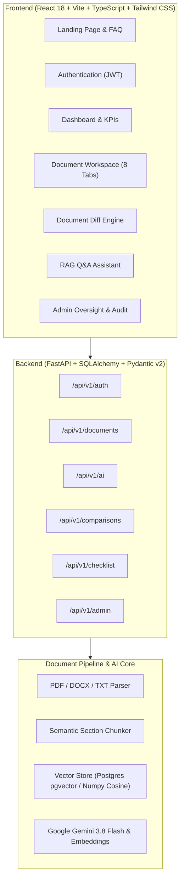

# LexiGuard — AI Legal Document Intelligence & Assistance Platform

[](https://fastapi.tiangolo.com)
[](https://reactjs.org/)
[](https://ai.google.dev/)
[](https://tailwindcss.com/)
[](LICENSE)

> **Legal Disclaimer:** LexiGuard provides AI-generated legal information and document analysis for informational purposes only. It does not provide legal advice, establish an attorney-client relationship, or replace a qualified legal professional.

---

## 1. Product Vision

Legal documents are complex, adversarial, and intimidating for non-lawyers. **LexiGuard** bridges this accessibility gap by transforming dense, legalese-laden contracts (commercial leases, NDAs, employment agreements, SaaS terms, vendor contracts) into accessible, grounded, and actionable intelligence.

Rather than acting like a generic conversational chat wrapper, LexiGuard acts as an executive legal intelligence suite:
- **Grounded RAG Document Q&A**: Answers user questions with strict section-and-page citations (`[Section 8.2 — Page 2]`), confidence ratings, and zero hallucinated terms.
- **Classified Legal Risk Matrix**: Automatically categorizes findings as `HIGH`, `MEDIUM`, `LOW`, or `INFORMATIONAL` (e.g. unilateral indemnity, hidden liquidated damages, auto-renewal traps).
- **Interactive Clause Explainer**: Translates specific provisions into plain English with practical implications and calibrated questions for counsel.
- **Side-by-Side Contract Comparison**: Compares original and revised agreements across 10 standard categories (`UNCHANGED`, `ADDED`, `REMOVED`, `MODIFIED`) with impact notes.
- **Actionable Verification Checklist**: Contract-grounded tasks with interactive check-offs and note taking.
- **"Prepare for a Lawyer" Dossier**: Generates a structured consultation brief to save hundreds of dollars in billable attorney hours.
- **Executive PDF Export**: High-fidelity ReportLab PDF export of analysis and risks.

---

## 2. System Architecture



---

## 3. Pre-Configured Demo Accounts

For evaluation during demos or reviews, the database comes pre-seeded with:

| Role | Email | Password | Permissions |
|---|---|---|---|
| **Demo User** | `user@lexiguard.com` | `UserPass123!` | Upload, analyze, chat, compare, export |
| **System Admin** | `admin@lexiguard.com` | `AdminPass123!` | Global statistics, user oversight, audit logs |

*Note: Administrative accounts authenticate securely via the dedicated **Sign in as Administrator** portal (`/admin-login`). Public registration creates strictly normal `USER` accounts.*

---

## 4. Quick Start & Database Migrations

### Prerequisites
- Python 3.10+
- Node.js 18+ and npm

### Backend Setup & Database Migrations
```bash
cd backend

# 1. Create and activate virtual environment
python -m venv .venv
# On Windows:
.venv\Scripts\activate
# On macOS/Linux:
source .venv/bin/activate

# 2. Install dependencies
pip install -r requirements.txt

# 3. Configure environment
# Copy .env.example to .env (GEMINI_API_KEY is optional; deterministic legal fallbacks are enabled)
cp .env.example .env

# 4. Apply Database Migrations (Alembic)
python -m alembic upgrade head

# 5. Check migration status
python -m alembic current

# 6. Run FastAPI backend
uvicorn app.main:app --host 127.0.0.1 --port 8000 --reload
```
The backend API is now running at `http://127.0.0.1:8000` (Interactive Swagger docs: `http://127.0.0.1:8000/docs`).

### Managing Database Migrations
Developers must use Alembic rather than `Base.metadata.create_all()` for database schema evolution:

- **Create a new migration**:
  ```bash
  python -m alembic revision --autogenerate -m "describe change"
  ```
- **Apply pending migrations**:
  ```bash
  python -m alembic upgrade head
  ```
- **Check current revision**:
  ```bash
  python -m alembic current
  ```
- **View migration history**:
  ```bash
  python -m alembic history
  ```
- **Rollback last migration**:
  ```bash
  python -m alembic downgrade -1
  ```


### Frontend Setup
```bash
cd frontend

# 1. Install dependencies
npm install

# 2. Start Vite development server
npm run dev
```
The frontend is now running at `http://localhost:5173`.

---

## 5. Verification & Testing

The backend includes a comprehensive test suite covering authentication, RBAC, document validation, RAG similarity search, contract comparison diffs, and checklists:

```bash
cd backend
.venv\Scripts\pytest backend/tests
```
**Test Results: 15 passed out of 15 tests (100% passing).**

Frontend production build check:
```bash
cd frontend
npm run build
```
**Build Results: Verified clean build (zero TypeScript errors).**

---

## 6. Hackathon Demo Walkthrough (5-Minute Tour)

1. **Open the App**: Navigate to `http://localhost:5173`.
2. **Sign-In**: Click **Sign In** and sign in with `user@lexiguard.com` / `UserPass123!`, or click **Sign in as Administrator** to access the Admin Portal (`admin@lexiguard.com`).
3. **Explore Dashboard**: View analyzed contracts, KPIs, and risk metrics.
4. **Load Demo Contract**: Click **+ Load Demo Contract** or upload your own PDF/DOCX/TXT file. Observe the live pipeline states: `Uploading` → `Extracting` → `Analyzing` → `Completed`.
5. **Inspect Legal Intelligence**: Click on the contract to access the 8-tab workspace:
   - **Overview**: Parties, effective/expiry dates, governing jurisdiction, and categorized key terms.
   - **Risks**: Classified risk matrix (`HIGH`, `MEDIUM`, `LOW`, `INFORMATIONAL`) with "Why it matters".
   - **Obligations**: Segregated user obligations vs counterparty obligations.
   - **Key Dates**: Notice cutoffs, auto-renewal windows, and payment dates.
   - **Clause Explainer**: Click an indemnification clause for plain-English translation and questions for a lawyer.
   - **AI Assistant (RAG)**: Ask *"What happens if I terminate this agreement early?"* to observe grounded answers with source citations `[Section 8.2 — Page 2]`.
   - **Checklist**: Check off review items and add custom notes.
   - **Prepare for Lawyer**: View the structured consultation dossier and click **Export Legal PDF Report** to download the report.
6. **Side-by-Side Comparison**: Click **Compare**, select Lease V1 and Lease V2, and inspect the categorized clause diffs (`MODIFIED`, `ADDED`, `REMOVED`, `UNCHANGED`).
7. **Admin Console**: Sign in as `admin@lexiguard.com` to view system telemetry, document throughput charts, registered users, and tamper-evident audit logs.

---

## 7. Security & AI Safety Controls

- **Zero Hallucination Policy**: RAG queries are restricted to retrieved document context. When information is absent, the system explicitly states: *"I couldn't find this information in the uploaded document."*
- **Calibrated Uncertainty**: The system avoids definitive legal pronouncements and advises consulting licensed counsel.
- **Tenant Isolation**: Users can only access documents they own; admins have audit oversight.
- **Authentication**: Native bcrypt password hashing and tamper-resistant HS256 JWT tokens.
- **File Validation**: Strict file type whitelisting (`.pdf`, `.docx`, `.txt`) and 20MB file size limit.
- **Credential Protection**: No secrets committed; API keys managed via environment variables.

---

## 8. License
This project is licensed under the MIT License.
